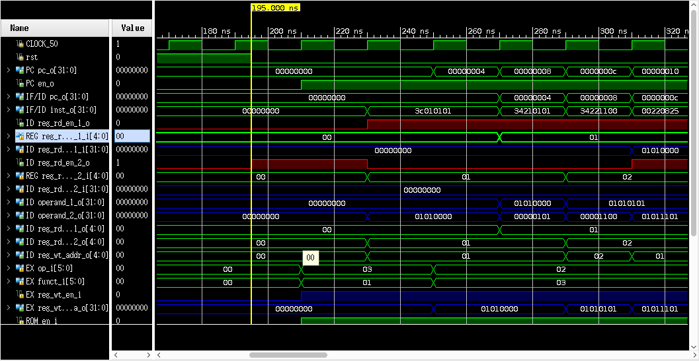
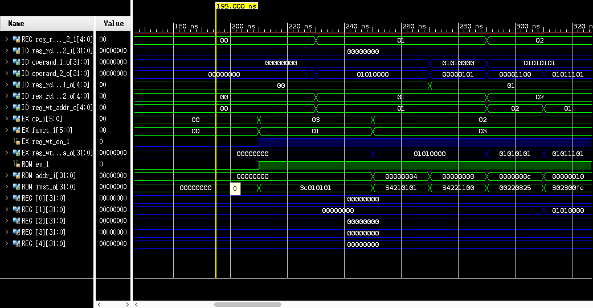
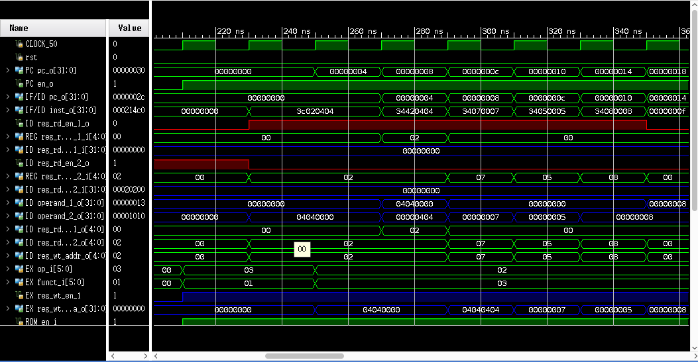
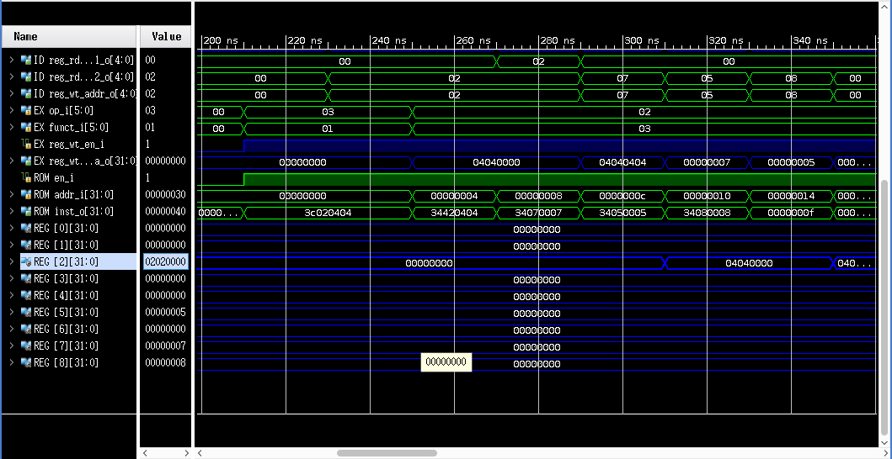
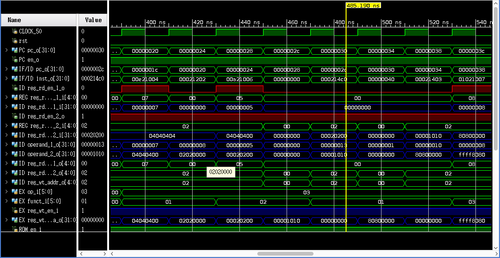
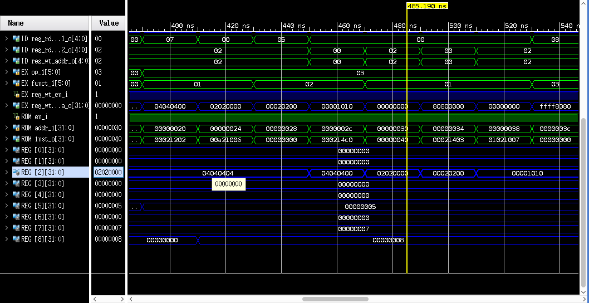

# Implementation of one instruction: ORI

## Simulation Result


# Implementation of Logic, Shift and Nop Instructions

## Logic Instructions
### Simulation Source

```
lui  $1,0x0101           # $1 = 0x01010000 
ori  $1,$1,0x0101        # $1 = $1 | 0x0101 = 0x01010101
ori  $2,$1,0x1100        # $2 = $1 | 0x1100 = 0x01011101
or   $1,$1,$2            # $1 = $1 | $2     = 0x01011101
andi $3,$1,0x00fe        # $3 = $1 & 0x00fe = 0x00000000
and  $1,$3,$1            # $1 = $3 & $1     = 0x00000000
xori $4,$1,0xff00        # $4 = $1 ^ 0xff00 = 0x0000ff00
xor  $1,$4,$1            # $1 = $4 ^ $1     = 0x0000ff00
nor  $1,$4,$1            # $1 = $4 ~^ $1    = 0xffff00ff
```

| inst | Reg1 read addr | Reg1 read data | Reg2 read addr | Reg2 read dara | Operand 1 | Operand2 | Reg write addr | Reg write data |
| --- | --- | --- | --- | --- | --- | --- | --- | --- |
| lui  $1,0x0101 | $0 | 0x00000000 | - | - | 0x00000000 | 0x01010000 | $1 | 0x01010000 |
| ori  $1,$1,0x0101 | $1 | 0x01010000 | - | - | 0x01010000 | 0x00000101 | $1 | 0x01010101 |
| ori  $2,$1,0x1100 | $1 | 0x01010101 | - | - | 0x01010101 | 0x00001100 | $2 | 0x01011101 |
| or   $1,$1,$2 | $1 | 0x01010101 | $2 | 0x01011101 | 0x01010101 | 0x01011101 | $1 | 0x01011101 |
| andi $3,$1,0x00fe | $1 | 0x01011101 | - | - | 0x01011101 | 0x000000fe | $3 | 0x00000000 |
| and  $1,$3,$1 | $3 | 0x00000000 | $1 | 0x01011101 | 0x00000000 | 0x01011101 | $1 | 0x00000000 |
| xori $4,$1,0xff00 | $1 | 0x00000000 | - | - | 0x00000000 | 0x0000ff00 | $4 | 0x0000ff00 |
| xor  $1,$4,$1 | $4 | 0x0000ff00 | $1 | 0x 00000000 | 0x0000ff00 | 0x00000000 | $1 | 0x0000ff00 | 
| nor  $1,$4,$1 | $4 | 0x0000ff00 | $1 | 0x0000ff00 | 0x0000ff00 | 0x0000ff00 | $1 | 0xffff00ff | 

### Simulation Result

Red signals are enable ones, and blue signals are data.






I deleted 'PREF' instruction from the test, because we do not intend to implement it.

# Implementation of Shift and Nop Instructions

## Simulation
### Simulation Source
```
lui   $2,0x0404    # $2 = 0x04040000
ori   $2,$2,0x0404 # $2 = 0x04040000 | 0x0404 = 0x04040404
ori   $7,$0,0x7
ori   $5,$0,0x5
ori   $8,$0,0x8
sync
sll   $2,$2,8      # $2 = 0x40404040 sll 8  = 0x04040400
sllv  $2,$2,$7     # $2 = 0x04040400 sll 7  = 0x02020000
srl   $2,$2,8      # $2 = 0x02020000 srl 8  = 0x00020200
srlv  $2,$2,$5     # $2 = 0x00020200 srl 5  = 0x00001010
nop
sll   $2,$2,19     # $2 = 0x00001010 sll 19 = 0x80800000
ssnop
sra   $2,$2,16     # $2 = 0x80800000 sra 16 = 0xffff8080
srav  $2,$2,$8     # $2 = 0xffff8080 sra 8  = 0xffffff80 
```

| inst | Reg1 read addr | Reg1 read data | Reg2 read addr | Reg2 read dara | Operand 1 | Operand2 | Reg write addr | Reg write data |
| --- | --- | --- | --- | --- | --- | --- | --- | --- |
| lui $2,0x0404 | $0 | 0x00000000 | - | - | 0x00000000 | 0x04040000 | $2 | 0x04040000 |
| ori $2,$2,0x0404 | $2 | 0x0x04040000 | - | - | 0x04040000 | 0x00000404 | $2 | 0x04040404 |
| ori $7,$0,0x7 | $0 | 0x00000000 | - | - | 0x00000000 | 0x00000007 | $7 | 0x00000007 |
| ori $5,$0,0x5 | $0 | 0x00000000 | - | - | 0x00000000 | 0x00000005 | $5 | 0x00000005 |
| ori $8,$0,0x8 | $0 | 0x00000000 | - | - | 0x00000000 | 0x00000008 | $8 | 0x00000008 |
| sync | - | - | - | - | - | - | - | - |
| sll $2,$2,8 | $2 | 0x04040404 | - | - | 0x04040404 | 0x00000008 | $2 | 0x04040000 |
| sllv $2,$2,$7 | $2 | 0x04040000 | $7 | 0x00000007 | 0x04040000 | 0x00000007 | $2 | 0x02020000 |
| srl $2,$2,8 | $2 | 0x02020000 | - | - | 0x02020000 | 0x00000008 | $2 | 0x00020200 |
| srlv $2,$2,$5 | $2 | 0x00020200 | $5 | 0x00000005 | 0x00020200 | 0x00000005 | $2 | 0x00001010 |
| nop | - | - | - | - | - | - | - | - |
| sll $2,$2,19 | $2 | 0x00001010 | - | - | 0x00001010 | 0x00000019 | $2 | 0x80800000 |
| ssnop | - | - | - | - | - | - | - | - |
| sra $2,$2,16 | $2 | 0x80800000 | - | - | 0x80800000 | 0x00000016 | $2 | 0xffff8080 |
| srav $2,$2,$8 | $2 | 0xffff8080 | $8 | 0x00000008 | 0xffff8080 | 0x00000008 | $2 | 0xffffff80 |

### Simulation Result

Red signals are enable ones, and blue signals are data.









# Implementation of Move Instructions
It is hard to make a good screenshot.